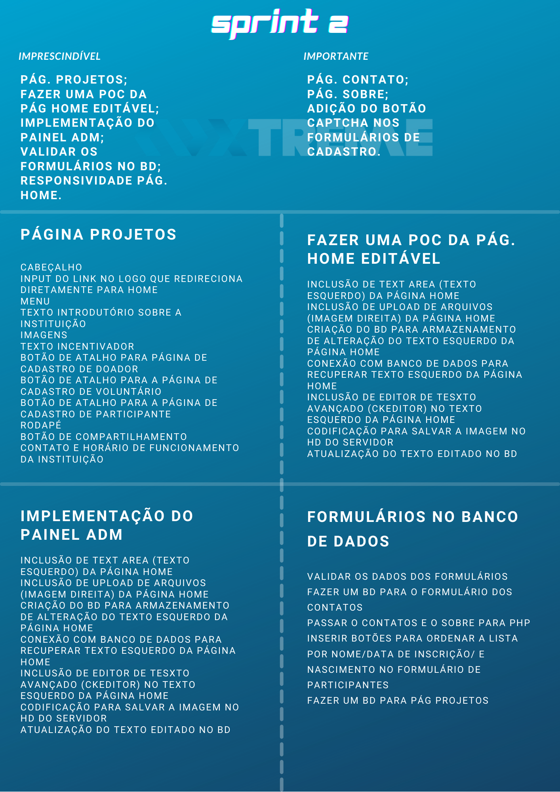
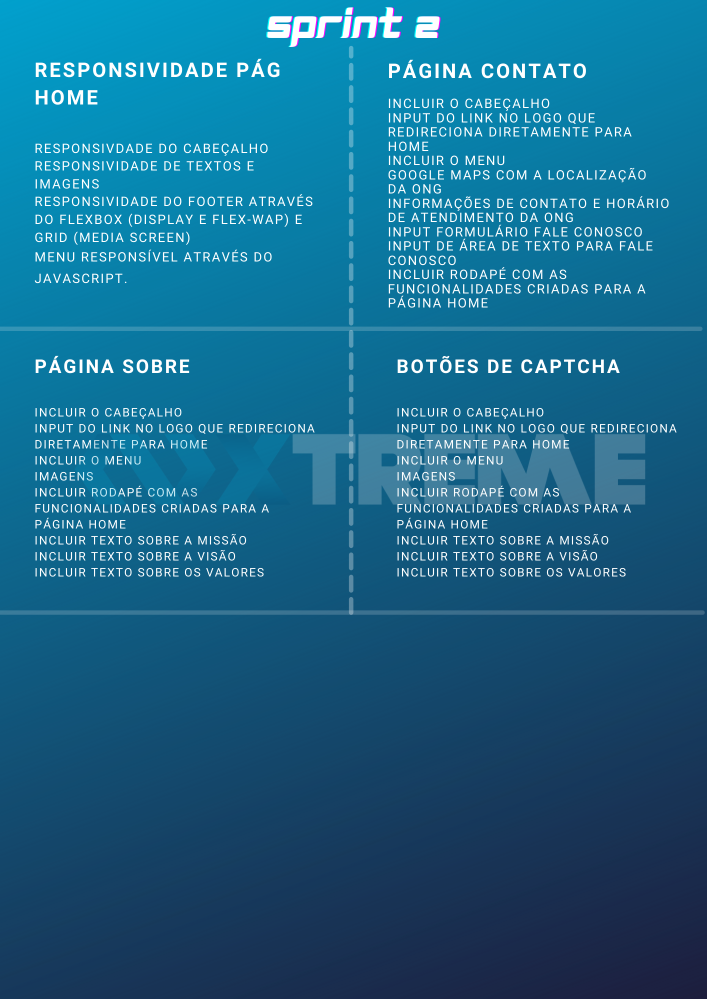

# Xtreme 

## :ballot_box_with_check: SPRINT 2

Nesta Sprint decidimos finalizar o site, adicionando as páginas que faltavam (projetos, contato e sobre). Inicializamos o painel administrivo, começando pela página home, incluimos restrições aos formulários de cadastro, captcha para evitar cadastros automatizados e incializamos também (a partir da página home) a responsividade mobile do site.

 

## Sprint Backlog 

<h1 align="center"> </h1>
 
<h1 align="center"> </h1>
 

## Burndown da Sprint

<h1 align="center"> </h1>

## Gráfico do Backlog

<h1 align="center"> </h1>

 

## :desktop_computer: Funcionalidades da Sprint

<h3 align="center">Página Projetos</h3>

<h1 align="center"> </h1>

 

<h3 align="center">Página Sobre</h3>

<h1 align="center"> </h1>

 

<h3 align="center">Página Contato</h3>

<h1 align="center"> </h1>

 

<h3 align="center">Painel Administrativo - Login</h3>

<h1 align="center"> </h1>

 

<h3 align="center">Home Editável</h3>

<h1 align="center"> </h1>

 

<h3 align="center">Botão Captcha</h3>

<h1 align="center"> </h1>

 

<h3 align="center">Responsividade mobile da página Home</h3>

<h1 align="center"> </h1>

 
<h3 align="center">Comprovação da responsividade pelo Google</h3>

<h1 align="center"> </h1>

 